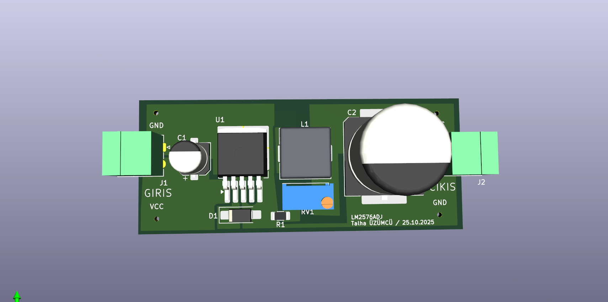
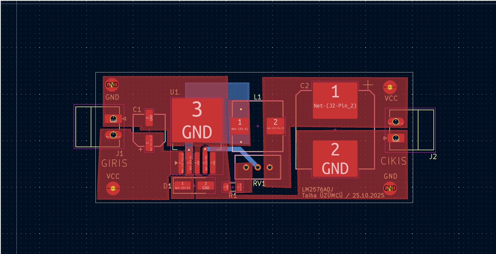

# LM2576 Adjustable Buck Converter PCB Design

This repository contains my KiCad PCB design project based on the LM2576 adjustable step-down switching regulator.

The project was designed as a DC-DC buck converter module that converts a higher DC input voltage to a lower adjustable DC output voltage. The PCB includes input/output terminal blocks, power components, feedback components, and a compact board layout.

---

## Project Overview

The main purpose of this project was to design a practical power electronics PCB using KiCad.

The circuit is based on the LM2576ADJ regulator. It uses an inductor, diode, input/output capacitors, and a feedback network to generate an adjustable regulated output voltage.

This type of circuit is commonly used in embedded systems and electronic projects where a stable lower DC voltage is required from a higher DC supply.

---

## 3D PCB View

The 3D view shows the physical placement of the main components, including the LM2576 regulator, inductor, capacitors, potentiometer, diode, and input/output connectors.

---

## PCB Layout

The PCB layout was created in KiCad.
The board includes wide power traces and separated input/output sections for better current handling and readability.

---

## Main Components

* LM2576ADJ switching regulator
* Inductor
* Schottky diode
* Input capacitor
* Output capacitor
* Feedback resistor
* Adjustable potentiometer
* Input terminal block
* Output terminal block
* GND and VCC connections

---

## Working Principle

The LM2576 works as a step-down switching regulator.

The input voltage is applied to the input terminal. The LM2576 switches the current through the inductor, while the diode and capacitors help smooth and regulate the output voltage.

The feedback network, including the potentiometer, is used to adjust the output voltage level. By changing the feedback ratio, the regulator changes its duty cycle and maintains the desired output voltage.

The output terminal provides the regulated lower DC voltage for external circuits.

---

## PCB Design Notes

* Input and output sections were clearly labeled as **GIRIS** and **CIKIS**
* Terminal blocks were used for easy external connection
* Power traces were designed wider than signal traces
* The feedback and adjustment components were placed close to the regulator
* The board was checked using KiCad 3D Viewer

---

## What I Learned

Through this project, I gained practical experience in:

* Designing a switching regulator PCB
* Using KiCad for PCB layout and 3D visualization
* Understanding LM2576 buck converter operation
* Placing power components on a PCB
* Routing high-current paths
* Designing input/output terminal connections
* Creating a compact power supply module

---

## Tools and Technologies

* KiCad
* LM2576ADJ
* DC-DC buck converter
* PCB design
* Power electronics
* Switching regulator
* 3D PCB visualization

---

## Author

**Talha Üzümcü**
Electrical and Electronics Engineer
GitHub: [talhazmc](https://github.com/talhazmc)
